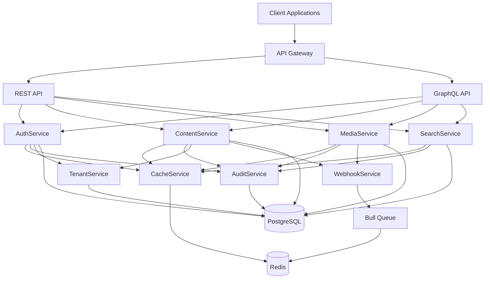

# Design Document

## Overview

This design document outlines the transformation of a complex content management system into a streamlined, senior-level application. The transformation focuses on modernizing the technology stack, consolidating architecture, and implementing best practices while maintaining all existing functionality.

The new architecture will demonstrate senior-level development skills through clean code, modern patterns, type safety, and production-ready scalability features. The system will transition from Express to Fastify, Mongoose to Drizzle ORM, MongoDB to PostgreSQL, and consolidate 21 services into 8 focused core services.

## Architecture

### High-Level Architecture



### Technology Stack Transformation

| Component            | Current            | New                   | Rationale                                             |
| -------------------- | ------------------ | --------------------- | ----------------------------------------------------- |
| Web Framework        | Express            | Fastify               | 3x performance improvement, better TypeScript support |
| Database             | MongoDB + Mongoose | PostgreSQL + Drizzle  | ACID compliance, type safety, better performance      |
| Validation           | Custom validators  | Zod                   | Runtime type safety, better DX                        |
| Testing              | Jest               | Vitest                | Faster execution, better ESM support                  |
| Linting/Formatting   | ESLint + Prettier  | Biome                 | Single tool, faster, better defaults                  |
| Dependency Injection | Manual             | tsyringe              | Proper IoC container, better testability              |
| Caching              | Basic Redis        | Advanced Redis + Bull | Background jobs, session management                   |

### Project Structure

```
src/
├── core/                           # Core infrastructure
│   ├── database/
│   │   ├── schema/                 # Drizzle schemas
│   │   │   ├── auth.schema.ts
│   │   │   ├── content.schema.ts
│   │   │   ├── media.schema.ts
│   │   │   └── tenant.schema.ts
│   │   ├── migrations/             # Database migrations
│   │   └── connection.ts           # DB connection with pooling
│   ├── types/                      # Global TypeScript types
│   │   ├── api.types.ts
│   │   ├── database.types.ts
│   │   └── service.types.ts
│   ├── errors/                     # Custom error classes
│   │   ├── base.error.ts
│   │   ├── validation.error.ts
│   │   └── business.error.ts
│   └── decorators/                 # Custom decorators
│       ├── auth.decorator.ts
│       ├── validate.decorator.ts
│       └── cache.decorator.ts
├── modules/                        # Feature modules
│   ├── auth/                       # Authentication module
│   │   ├── auth.service.ts
│   │   ├── auth.repository.ts
│   │   ├── auth.controller.ts
│   │   └── auth.types.ts
│   ├── tenant/                     # Multi-tenancy module
│   ├── content/                    # Content management
│   ├── media/                      # File management
│   ├── search/                     # Search functionality
│   ├── webhook/                    # Event system
│   ├── cache/                      # Caching service
│   └── audit/                      # Logging and monitoring
├── shared/                         # Shared utilities
│   ├── middleware/                 # Fastify middleware
│   ├── utils/                      # Utility functions
│   ├── validators/                 # Zod schemas
│   └── constants/                  # Application constants
├── api/                           # API layer
│   ├── rest/                      # REST endpoints
│   │   ├── routes/
│   │   └── plugins/
│   ├── graphql/                   # GraphQL resolvers
│   │   ├── resolvers/
│   │   ├── schemas/
│   │   └── dataloaders/
│   └── gateway.ts                 # Unified API gateway
└── app.ts                         # Application entry point
```

## Components and Interfaces

### Core Services Architecture

#### 1. AuthService

```typescript
interface IAuthService {
  authenticate(
    credentials: LoginCredentials
  ): Promise<Result<AuthResult, AuthError>>;
  generateTokens(userId: string): Promise<Result<TokenPair, TokenError>>;
  refreshToken(refreshToken: string): Promise<Result<TokenPair, TokenError>>;
  validateToken(token: string): Promise<Result<UserPayload, ValidationError>>;
  revokeToken(token: string): Promise<Result<void, TokenError>>;
}
```

#### 2. TenantService

```typescript
interface ITenantService {
  createTenant(data: CreateTenantData): Promise<Result<Tenant, TenantError>>;
  getTenant(id: string): Promise<Result<Tenant, NotFoundError>>;
  updateTenant(
    id: string,
    data: UpdateTenantData
  ): Promise<Result<Tenant, TenantError>>;
  deleteTenant(id: string): Promise<Result<void, TenantError>>;
  getUserTenants(userId: string): Promise<Result<Tenant[], TenantError>>;
}
```

#### 3. ContentService

```typescript
interface IContentService {
  createContent(
    data: CreateContentData
  ): Promise<Result<Content, ContentError>>;
  getContent(
    id: string,
    version?: string
  ): Promise<Result<Content, NotFoundError>>;
  updateContent(
    id: string,
    data: UpdateContentData
  ): Promise<Result<Content, ContentError>>;
  deleteContent(id: string): Promise<Result<void, ContentError>>;
  publishContent(id: string): Promise<Result<Content, PublishError>>;
  getContentVersions(
    id: string
  ): Promise<Result<ContentVersion[], ContentError>>;
}
```

#### 4. MediaService

```typescript
interface IMediaService {
  uploadFile(
    file: FileUpload,
    metadata: MediaMetadata
  ): Promise<Result<Media, UploadError>>;
  getFile(id: string): Promise<Result<Media, NotFoundError>>;
  deleteFile(id: string): Promise<Result<void, MediaError>>;
  processImage(
    id: string,
    transformations: ImageTransform[]
  ): Promise<Result<Media, ProcessError>>;
  generateCdnUrl(
    id: string,
    options?: CdnOptions
  ): Promise<Result<string, MediaError>>;
}
```

### Repository Pattern Implementation

```typescript
interface IRepository<T, K = string> {
  create(data: Omit<T, "id">): Promise<Result<T, DatabaseError>>;
  findById(id: K): Promise<Result<T | null, DatabaseError>>;
  findMany(filter: FilterOptions<T>): Promise<Result<T[], DatabaseError>>;
  update(id: K, data: Partial<T>): Promise<Result<T, DatabaseError>>;
  delete(id: K): Promise<Result<void, DatabaseError>>;
}

// Example implementation
@injectable()
export class ContentRepository implements IRepository<Content> {
  constructor(@inject("Database") private db: DrizzleDatabase) {}

  async create(
    data: Omit<Content, "id">
  ): Promise<Result<Content, DatabaseError>> {
    try {
      const [content] = await this.db
        .insert(contentSchema)
        .values(data)
        .returning();

      return { success: true, data: content };
    } catch (error) {
      return {
        success: false,
        error: new DatabaseError("Failed to create content", error),
      };
    }
  }
}
```

### Dependency Injection Container Setup

```typescript
// Container configuration
container.register<IAuthService>("AuthService", {
  useClass: AuthService,
});

container.register<IContentRepository>("ContentRepository", {
  useClass: ContentRepository,
});

container.register<ICacheService>("CacheService", {
  useClass: CacheService,
});
```

## Data Models

### Drizzle Schema Definitions

```typescript
// auth.schema.ts
export const users = pgTable("users", {
  id: uuid("id").primaryKey().defaultRandom(),
  email: varchar("email", { length: 255 }).notNull().unique(),
  passwordHash: varchar("password_hash", { length: 255 }).notNull(),
  role: varchar("role", { length: 50 }).notNull().default("user"),
  tenantId: uuid("tenant_id").references(() => tenants.id),
  createdAt: timestamp("created_at").defaultNow(),
  updatedAt: timestamp("updated_at").defaultNow(),
});

// content.schema.ts
export const contents = pgTable("contents", {
  id: uuid("id").primaryKey().defaultRandom(),
  title: varchar("title", { length: 255 }).notNull(),
  slug: varchar("slug", { length: 255 }).notNull(),
  body: text("body"),
  status: varchar("status", { length: 20 }).notNull().default("draft"),
  version: integer("version").notNull().default(1),
  tenantId: uuid("tenant_id").references(() => tenants.id),
  authorId: uuid("author_id").references(() => users.id),
  createdAt: timestamp("created_at").defaultNow(),
  updatedAt: timestamp("updated_at").defaultNow(),
});

// Relations
export const contentRelations = relations(contents, ({ one, many }) => ({
  author: one(users, {
    fields: [contents.authorId],
    references: [users.id],
  }),
  tenant: one(tenants, {
    fields: [contents.tenantId],
    references: [tenants.id],
  }),
  versions: many(contentVersions),
}));
```

### Type-Safe Database Operations

```typescript
// Type-safe queries with Drizzle
const getContentWithAuthor = async (id: string) => {
  return await db
    .select({
      id: contents.id,
      title: contents.title,
      body: contents.body,
      author: {
        id: users.id,
        email: users.email,
        role: users.role,
      },
    })
    .from(contents)
    .leftJoin(users, eq(contents.authorId, users.id))
    .where(eq(contents.id, id));
};
```

## Error Handling

### Result Pattern Implementation

```typescript
// Result type for error handling
export type Result<T, E = Error> =
  | { success: true; data: T }
  | { success: false; error: E };

// Custom error hierarchy
export abstract class BaseError extends Error {
  abstract readonly code: string;
  abstract readonly statusCode: number;

  constructor(message: string, public readonly cause?: unknown) {
    super(message);
    this.name = this.constructor.name;
  }
}

export class ValidationError extends BaseError {
  readonly code = "VALIDATION_ERROR";
  readonly statusCode = 400;
}

export class NotFoundError extends BaseError {
  readonly code = "NOT_FOUND";
  readonly statusCode = 404;
}

export class DatabaseError extends BaseError {
  readonly code = "DATABASE_ERROR";
  readonly statusCode = 500;
}
```

### Error Boundary Middleware

```typescript
export const errorHandler: FastifyErrorHandler = async (
  error,
  request,
  reply
) => {
  if (error instanceof BaseError) {
    return reply.status(error.statusCode).send({
      error: {
        code: error.code,
        message: error.message,
        timestamp: new Date().toISOString(),
      },
    });
  }

  // Log unexpected errors
  request.log.error(error);

  return reply.status(500).send({
    error: {
      code: "INTERNAL_SERVER_ERROR",
      message: "An unexpected error occurred",
    },
  });
};
```

## Testing Strategy

### Test Architecture

```typescript
// Service testing with dependency injection
describe("ContentService", () => {
  let contentService: ContentService;
  let mockRepository: jest.Mocked<IContentRepository>;
  let mockCacheService: jest.Mocked<ICacheService>;

  beforeEach(() => {
    mockRepository = createMockRepository();
    mockCacheService = createMockCacheService();

    container.register("ContentRepository", { useValue: mockRepository });
    container.register("CacheService", { useValue: mockCacheService });

    contentService = container.resolve(ContentService);
  });

  it("should create content successfully", async () => {
    const contentData = { title: "Test", body: "Content" };
    const expectedContent = { id: "123", ...contentData };

    mockRepository.create.mockResolvedValue({
      success: true,
      data: expectedContent,
    });

    const result = await contentService.createContent(contentData);

    expect(result.success).toBe(true);
    if (result.success) {
      expect(result.data).toEqual(expectedContent);
    }
  });
});
```

### Integration Testing

```typescript
// API integration tests
describe("Content API", () => {
  let app: FastifyInstance;

  beforeAll(async () => {
    app = await createTestApp();
  });

  it("should create content via REST API", async () => {
    const response = await app.inject({
      method: "POST",
      url: "/api/v1/content",
      headers: {
        authorization: "Bearer valid-token",
      },
      payload: {
        title: "Test Content",
        body: "This is test content",
      },
    });

    expect(response.statusCode).toBe(201);
    const content = JSON.parse(response.payload);
    expect(content.title).toBe("Test Content");
  });
});
```

### Performance Testing

```typescript
// Performance benchmarks
describe("Performance Tests", () => {
  it("should handle 1000 concurrent requests", async () => {
    const promises = Array.from({ length: 1000 }, () =>
      app.inject({
        method: "GET",
        url: "/api/v1/content",
      })
    );

    const start = Date.now();
    const responses = await Promise.all(promises);
    const duration = Date.now() - start;

    expect(responses.every((r) => r.statusCode === 200)).toBe(true);
    expect(duration).toBeLessThan(5000); // Should complete in under 5 seconds
  });
});
```

## API Design

### Fastify Plugin Architecture

```typescript
// REST API plugin
export const restApiPlugin: FastifyPluginAsync = async (fastify) => {
  // Register schemas
  fastify.addSchema(contentSchema);
  fastify.addSchema(userSchema);

  // Register routes
  await fastify.register(authRoutes, { prefix: "/auth" });
  await fastify.register(contentRoutes, { prefix: "/content" });
  await fastify.register(mediaRoutes, { prefix: "/media" });
};

// GraphQL plugin
export const graphqlPlugin: FastifyPluginAsync = async (fastify) => {
  await fastify.register(mercurius, {
    schema: buildSchema(),
    resolvers: buildResolvers(),
    context: buildContext,
    subscription: true,
  });
};
```

### Unified API Gateway

```typescript
export const createApp = async (): Promise<FastifyInstance> => {
  const app = fastify({
    logger: true,
    trustProxy: true,
  });

  // Register plugins
  await app.register(helmet);
  await app.register(cors);
  await app.register(rateLimit);

  // Register API plugins
  await app.register(restApiPlugin, { prefix: "/api/v1" });
  await app.register(graphqlPlugin, { prefix: "/graphql" });

  // Error handling
  app.setErrorHandler(errorHandler);

  return app;
};
```

This design provides a comprehensive blueprint for transforming the complex system into a streamlined, senior-level application that demonstrates modern best practices, type safety, and production-ready architecture.
