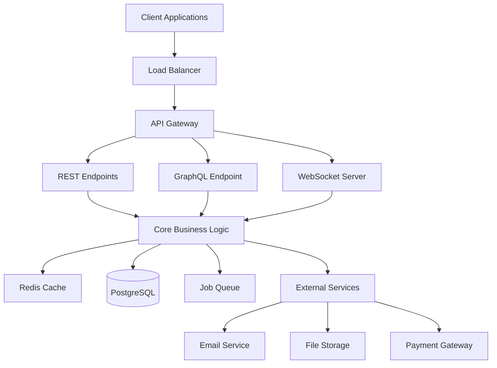
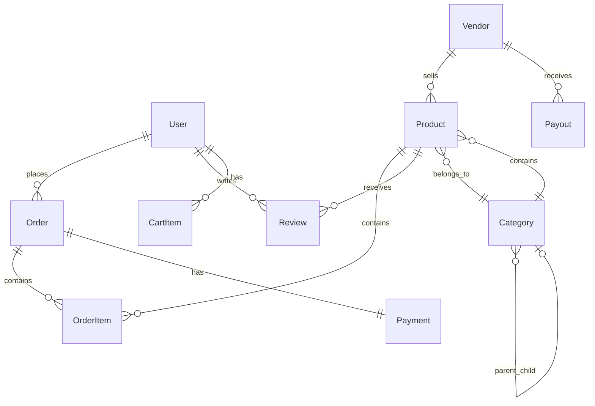

# Design Document

## Overview

This design document outlines the comprehensive transformation of the existing Express.js e-commerce backend from a verbose, MongoDB-based architecture to a modern, clean, and highly performant system. The transformation will reduce code complexity by 60-70% while enhancing functionality, type safety, and maintainability.

### Key Design Principles

- **Minimalism**: Reduce verbose patterns while maintaining functionality
- **Type Safety**: 100% TypeScript coverage with compile-time guarantees
- **Performance**: Optimize database queries, caching, and response times
- **Scalability**: Design for horizontal scaling and microservice architecture
- **Developer Experience**: Clean, readable code that impresses hiring managers
- **Modern Standards**: Use current best practices and enterprise patterns

## Architecture

### High-Level Architecture



### New Project Structure

```
ecommerce-backend/
├── 📄 .env
├── 📄 .env.example
├── 📄 .gitignore
├── 📄 biome.json
├── 📄 cspell.json
├── 📄 drizzle.config.ts
├── 📄 package.json
├── 📄 package-lock.json
├── 📄 README.md
├── 📄 tsconfig.json
├── 📄 vitest.config.ts
│
├── 📁 dist/                          # Build output
├── 📁 node_modules/                  # Dependencies
│
├── 📁 scripts/                       # Utility scripts
│   ├── 📄 migrate.ts
│   ├── 📄 seed-data.ts
│   └── 📄 optimize-performance.ts
│
└── 📁 src/                           # Source code
    ├── 📄 app.ts
    ├── 📄 server.ts
    │
    ├── 📁 api/                       # API layer
    │   ├── 📄 gateway.ts
    │   ├── 📁 graphql/
    │   │   ├── 📄 context.ts
    │   │   ├── 📄 index.ts
    │   │   ├── 📄 plugin.ts
    │   │   ├── 📁 dataloaders/
    │   │   │   ├── 📄 product.loader.ts
    │   │   │   ├── 📄 vendor.loader.ts
    │   │   │   └── 📄 user.loader.ts
    │   │   ├── 📁 resolvers/
    │   │   │   ├── 📄 index.ts
    │   │   │   ├── 📄 product.resolver.ts
    │   │   │   ├── 📄 vendor.resolver.ts
    │   │   │   ├── 📄 order.resolver.ts
    │   │   │   └── 📄 user.resolver.ts
    │   │   └── 📁 schema/
    │   │       ├── 📄 index.ts
    │   │       ├── 📄 product.schema.ts
    │   │       ├── 📄 vendor.schema.ts
    │   │       ├── 📄 order.schema.ts
    │   │       └── 📄 user.schema.ts
    │   └── 📁 rest/
    │       ├── 📄 index.ts
    │       ├── 📄 plugin.ts
    │       └── 📁 routes/
    │           ├── 📄 index.ts
    │           ├── 📄 auth.routes.ts
    │           ├── 📄 product.routes.ts
    │           ├── 📄 vendor.routes.ts
    │           ├── 📄 order.routes.ts
    │           └── 📄 user.routes.ts
    │
    ├── 📁 core/                      # Core system
    │   ├── 📁 container/             # Dependency injection
    │   │   ├── 📄 index.ts
    │   │   └── 📄 registry.ts
    │   ├── 📁 database/              # Database layer
    │   │   ├── 📄 connection.ts
    │   │   ├── 📄 index.ts
    │   │   ├── 📁 migrations/
    │   │   │   ├── 📄 0001_initial.sql
    │   │   │   ├── 📄 0002_add_vendors.sql
    │   │   │   └── 📄 0003_add_products.sql
    │   │   └── 📁 schema/
    │   │       ├── 📄 index.ts
    │   │       ├── 📄 users.ts
    │   │       ├── 📄 vendors.ts
    │   │       ├── 📄 products.ts
    │   │       ├── 📄 orders.ts
    │   │       └── 📄 relations.ts
    │   ├── 📁 decorators/            # System decorators
    │   │   ├── 📄 auth.decorator.ts
    │   │   ├── 📄 cache.decorator.ts
    │   │   └── 📄 validate.decorator.ts
    │   ├── 📁 errors/                # Error handling
    │   │   ├── 📄 app-error.ts
    │   │   ├── 📄 error-handler.ts
    │   │   └── 📄 error-types.ts
    │   ├── 📁 repositories/          # Repository pattern
    │   │   ├── 📄 base.repository.ts
    │   │   ├── 📄 user.repository.ts
    │   │   ├── 📄 vendor.repository.ts
    │   │   ├── 📄 product.repository.ts
    │   │   └── 📄 order.repository.ts
    │   └── 📁 types/                 # Core types
    │       ├── 📄 database.ts
    │       ├── 📄 entities.ts
    │       └── 📄 common.ts
    │
    ├── 📁 modules/                   # Feature modules
    │   ├── 📄 index.ts
    │   ├── 📁 auth/
    │   │   ├── 📄 auth.service.ts
    │   │   ├── 📄 jwt.service.ts
    │   │   └── 📄 auth.controller.ts
    │   ├── 📁 cache/
    │   │   ├── 📄 cache.service.ts
    │   │   ├── 📄 redis.client.ts
    │   │   └── 📄 cache.strategies.ts
    │   ├── 📁 ecommerce/
    │   │   ├── 📁 products/
    │   │   │   ├── 📄 product.service.ts
    │   │   │   ├── 📄 product.controller.ts
    │   │   │   └── 📄 product.types.ts
    │   │   ├── 📁 vendors/
    │   │   │   ├── 📄 vendor.service.ts
    │   │   │   ├── 📄 vendor.controller.ts
    │   │   │   ├── 📄 vendor.types.ts
    │   │   │   └── 📄 payout.service.ts
    │   │   ├── 📁 orders/
    │   │   │   ├── 📄 order.service.ts
    │   │   │   ├── 📄 order.controller.ts
    │   │   │   └── 📄 order.types.ts
    │   │   ├── 📁 cart/
    │   │   │   ├── 📄 cart.service.ts
    │   │   │   └── 📄 cart.controller.ts
    │   │   └── 📁 payments/
    │   │       ├── 📄 payment.service.ts
    │   │       ├── 📄 payment.controller.ts
    │   │       └── 📄 payment.types.ts
    │   ├── 📁 media/
    │   │   ├── 📄 upload.service.ts
    │   │   ├── 📄 media.controller.ts
    │   │   └── 📄 storage.service.ts
    │   ├── 📁 notifications/
    │   │   ├── 📄 email.service.ts
    │   │   ├── 📄 notification.service.ts
    │   │   └── 📄 websocket.service.ts
    │   ├── 📁 analytics/
    │   │   ├── 📄 analytics.service.ts
    │   │   ├── 📄 metrics.service.ts
    │   │   └── 📄 reporting.service.ts
    │   └── 📁 webhook/
    │       ├── 📄 webhook.service.ts
    │       ├── 📄 webhook.controller.ts
    │       └── 📄 webhook.types.ts
    │
    └── 📁 shared/                    # Shared utilities
        ├── 📄 index.ts
        ├── 📁 config/
        │   ├── 📄 database.config.ts
        │   ├── 📄 redis.config.ts
        │   ├── 📄 app.config.ts
        │   └── 📄 env.config.ts
        ├── 📁 middleware/
        │   ├── 📄 auth.middleware.ts
        │   ├── 📄 cors.middleware.ts
        │   ├── 📄 rate-limit.middleware.ts
        │   └── 📄 request-id.middleware.ts
        ├── 📁 utils/
        │   ├── 📄 crypto.utils.ts
        │   ├── 📄 date.utils.ts
        │   ├── 📄 string.utils.ts
        │   └── 📄 response.utils.ts
        └── 📁 validators/
            ├── 📄 auth.validators.ts
            ├── 📄 product.validators.ts
            ├── 📄 vendor.validators.ts
            └── 📄 order.validators.ts
```

## Components and Interfaces

### 1. Database Layer (PostgreSQL + Drizzle)

#### Schema Design

```typescript
// src/db/schema/users.ts
export const users = pgTable("users", {
  id: uuid("id").primaryKey().defaultRandom(),
  email: varchar("email", { length: 255 }).notNull().unique(),
  password: varchar("password", { length: 255 }).notNull(),
  role: roleEnum("role").default("customer"),
  createdAt: timestamp("created_at").defaultNow(),
  updatedAt: timestamp("updated_at").defaultNow(),
});

// src/db/schema/vendors.ts
export const vendors = pgTable("vendors", {
  id: uuid("id").primaryKey().defaultRandom(),
  businessName: varchar("business_name", { length: 255 }).notNull(),
  slug: varchar("slug", { length: 255 }).notNull().unique(),
  email: varchar("email", { length: 255 }).notNull().unique(),
  status: vendorStatusEnum("status").default("pending"),
  commissionRate: decimal("commission_rate", {
    precision: 5,
    scale: 2,
  }).default("10.00"),
  createdAt: timestamp("created_at").defaultNow(),
});
```

#### Repository Pattern

```typescript
// src/core/repositories/user.repository.ts
export class UserRepository {
  constructor(private db: DrizzleDB) {}

  async findById(id: string): Promise<User | null> {
    const [user] = await this.db
      .select()
      .from(users)
      .where(eq(users.id, id))
      .limit(1);
    return user || null;
  }

  async create(data: CreateUserData): Promise<User> {
    const [user] = await this.db.insert(users).values(data).returning();
    return user;
  }
}
```

### 2. Core Business Logic

#### Clean Service Layer

```typescript
// src/core/services/vendor.service.ts
export class VendorService {
  constructor(
    private vendorRepo: VendorRepository,
    private cache: CacheService,
    private events: EventEmitter
  ) {}

  async createVendor(data: CreateVendorInput): Promise<Vendor> {
    const vendor = await this.vendorRepo.create({
      ...data,
      slug: this.generateSlug(data.businessName),
    });

    this.events.emit("vendor.created", vendor);
    return vendor;
  }

  async getVendor(id: string): Promise<Vendor> {
    return this.cache.getOrSet(
      `vendor:${id}`,
      () => this.vendorRepo.findById(id),
      3600
    );
  }
}
```

#### Use Cases (Application Layer)

```typescript
// src/core/use-cases/create-vendor.use-case.ts
export class CreateVendorUseCase {
  constructor(
    private vendorService: VendorService,
    private validator: ValidationService
  ) {}

  async execute(input: CreateVendorInput): Promise<VendorOutput> {
    const validatedInput = this.validator.validate(createVendorSchema, input);
    const vendor = await this.vendorService.createVendor(validatedInput);
    return this.mapToOutput(vendor);
  }
}
```

### 3. API Layer

#### Clean REST Controllers

```typescript
// src/api/rest/vendor.controller.ts
export class VendorController {
  constructor(private createVendorUseCase: CreateVendorUseCase) {}

  @Post("/")
  @Auth(["admin"])
  async create(
    @Body() body: CreateVendorInput
  ): Promise<ApiResponse<VendorOutput>> {
    const vendor = await this.createVendorUseCase.execute(body);
    return { success: true, data: vendor };
  }

  @Get("/:id")
  async getById(@Param("id") id: string): Promise<ApiResponse<VendorOutput>> {
    const vendor = await this.getVendorUseCase.execute({ id });
    return { success: true, data: vendor };
  }
}
```

#### GraphQL Schema & Resolvers

```typescript
// src/api/graphql/schema.ts
export const typeDefs = gql`
  type Vendor {
    id: ID!
    businessName: String!
    slug: String!
    email: String!
    status: VendorStatus!
    products: [Product!]!
    metrics: VendorMetrics!
  }

  type Query {
    vendor(id: ID!): Vendor
    vendors(filter: VendorFilter, pagination: Pagination): VendorConnection!
  }

  type Mutation {
    createVendor(input: CreateVendorInput!): Vendor!
    updateVendor(id: ID!, input: UpdateVendorInput!): Vendor!
  }
`;

// src/api/graphql/resolvers/vendor.resolver.ts
export const vendorResolvers = {
  Query: {
    vendor: async (_, { id }, { dataSources }) =>
      dataSources.vendorService.getVendor(id),

    vendors: async (_, { filter, pagination }, { dataSources }) =>
      dataSources.vendorService.getVendors(filter, pagination),
  },

  Mutation: {
    createVendor: async (_, { input }, { dataSources }) =>
      dataSources.vendorService.createVendor(input),
  },
};
```

### 4. Validation Layer (Zod)

```typescript
// src/lib/validation/vendor.schemas.ts
export const createVendorSchema = z.object({
  businessName: z.string().min(3).max(100),
  email: z.string().email(),
  phone: z.string().regex(/^\+?[\d\s-()]+$/),
  description: z.string().min(10).max(2000),
  contactPerson: z.object({
    firstName: z.string().min(1),
    lastName: z.string().min(1),
    email: z.string().email(),
    position: z.string().min(1),
  }),
});

export type CreateVendorInput = z.infer<typeof createVendorSchema>;
```

### 5. Caching Strategy

```typescript
// src/lib/cache/cache.service.ts
export class CacheService {
  constructor(private redis: Redis) {}

  async getOrSet<T>(
    key: string,
    fetcher: () => Promise<T>,
    ttl: number = 3600
  ): Promise<T> {
    const cached = await this.get<T>(key);
    if (cached) return cached;

    const data = await fetcher();
    await this.set(key, data, ttl);
    return data;
  }

  async invalidatePattern(pattern: string): Promise<void> {
    const keys = await this.redis.keys(pattern);
    if (keys.length > 0) {
      await this.redis.del(...keys);
    }
  }
}
```

## Data Models

### Simplified Entity Definitions

```typescript
// src/types/entities.ts
export interface User {
  id: string;
  email: string;
  role: UserRole;
  profile?: UserProfile;
  createdAt: Date;
  updatedAt: Date;
}

export interface Vendor {
  id: string;
  businessName: string;
  slug: string;
  email: string;
  status: VendorStatus;
  commissionRate: number;
  contactPerson: ContactPerson;
  addresses: Address[];
  bankAccounts: BankAccount[];
  metrics: VendorMetrics;
  createdAt: Date;
  updatedAt: Date;
}

export interface Product {
  id: string;
  name: string;
  slug: string;
  description: string;
  price: number;
  vendorId: string;
  categoryId: string;
  images: string[];
  inventory: ProductInventory;
  seo: ProductSEO;
  createdAt: Date;
  updatedAt: Date;
}
```

### Database Relationships



## Error Handling

### Centralized Error Management

```typescript
// src/lib/errors/error-handler.ts
export class AppError extends Error {
  constructor(
    public message: string,
    public statusCode: number = 500,
    public code?: string,
    public details?: any
  ) {
    super(message);
    this.name = this.constructor.name;
  }
}

export const errorHandler = (
  error: Error,
  req: Request,
  res: Response,
  next: NextFunction
) => {
  const logger = getLogger(req.id);

  if (error instanceof AppError) {
    logger.warn(`App Error: ${error.message}`, { error });
    return res.status(error.statusCode).json({
      success: false,
      error: {
        message: error.message,
        code: error.code,
        details: error.details,
      },
    });
  }

  if (error instanceof ZodError) {
    logger.warn(`Validation Error`, { error: error.errors });
    return res.status(400).json({
      success: false,
      error: {
        message: "Validation failed",
        code: "VALIDATION_ERROR",
        details: error.errors,
      },
    });
  }

  logger.error(`Unhandled Error: ${error.message}`, { error });
  res.status(500).json({
    success: false,
    error: { message: "Internal server error" },
  });
};
```

## Testing Strategy

### Test Structure

```typescript
// src/core/services/__tests__/vendor.service.test.ts
describe("VendorService", () => {
  let service: VendorService;
  let mockRepo: jest.Mocked<VendorRepository>;
  let mockCache: jest.Mocked<CacheService>;

  beforeEach(() => {
    mockRepo = createMockRepository();
    mockCache = createMockCache();
    service = new VendorService(mockRepo, mockCache, new EventEmitter());
  });

  describe("createVendor", () => {
    it("should create vendor with generated slug", async () => {
      const input = {
        businessName: "Test Business",
        email: "test@example.com",
      };
      const expected = { ...input, id: "uuid", slug: "test-business" };

      mockRepo.create.mockResolvedValue(expected);

      const result = await service.createVendor(input);

      expect(result).toEqual(expected);
      expect(mockRepo.create).toHaveBeenCalledWith({
        ...input,
        slug: "test-business",
      });
    });
  });
});
```

### Integration Tests

```typescript
// src/api/rest/__tests__/vendor.controller.integration.test.ts
describe("Vendor API Integration", () => {
  let app: Express;
  let db: DrizzleDB;

  beforeAll(async () => {
    db = await setupTestDatabase();
    app = createTestApp(db);
  });

  afterAll(async () => {
    await cleanupTestDatabase(db);
  });

  describe("POST /vendors", () => {
    it("should create vendor successfully", async () => {
      const vendorData = {
        businessName: "Test Vendor",
        email: "vendor@test.com",
        phone: "+1234567890",
        description: "Test description",
      };

      const response = await request(app)
        .post("/api/v1/vendors")
        .send(vendorData)
        .expect(201);

      expect(response.body.success).toBe(true);
      expect(response.body.data.businessName).toBe(vendorData.businessName);
    });
  });
});
```

## Performance Optimizations

### Database Query Optimization

```typescript
// Optimized queries with proper indexing
export const getVendorWithProducts = async (vendorId: string) => {
  return db
    .select({
      vendor: vendors,
      products: products,
    })
    .from(vendors)
    .leftJoin(products, eq(vendors.id, products.vendorId))
    .where(eq(vendors.id, vendorId));
};

// Pagination with cursor-based approach
export const getVendorsPaginated = async (cursor?: string, limit = 20) => {
  const query = db
    .select()
    .from(vendors)
    .orderBy(desc(vendors.createdAt))
    .limit(limit + 1);

  if (cursor) {
    query.where(lt(vendors.createdAt, new Date(cursor)));
  }

  return query;
};
```

### Caching Strategy

```typescript
// Multi-level caching
export class VendorCacheService {
  private readonly TTL = {
    VENDOR: 3600, // 1 hour
    VENDOR_LIST: 1800, // 30 minutes
    VENDOR_METRICS: 7200, // 2 hours
  };

  async getVendor(id: string): Promise<Vendor | null> {
    // L1: Memory cache
    const memoryCache = this.memoryCache.get(`vendor:${id}`);
    if (memoryCache) return memoryCache;

    // L2: Redis cache
    const redisCache = await this.redis.get(`vendor:${id}`);
    if (redisCache) {
      this.memoryCache.set(`vendor:${id}`, redisCache, 300); // 5 min
      return redisCache;
    }

    // L3: Database
    const vendor = await this.vendorRepo.findById(id);
    if (vendor) {
      await this.redis.setex(`vendor:${id}`, this.TTL.VENDOR, vendor);
      this.memoryCache.set(`vendor:${id}`, vendor, 300);
    }

    return vendor;
  }
}
```

## Security Enhancements

### Authentication & Authorization

```typescript
// src/lib/auth/jwt.service.ts
export class JWTService {
  private readonly accessTokenSecret = process.env.JWT_ACCESS_SECRET!;
  private readonly refreshTokenSecret = process.env.JWT_REFRESH_SECRET!;

  generateTokens(payload: TokenPayload): TokenPair {
    const accessToken = jwt.sign(payload, this.accessTokenSecret, {
      expiresIn: "15m",
      issuer: "ecommerce-api",
      audience: "ecommerce-client",
    });

    const refreshToken = jwt.sign(payload, this.refreshTokenSecret, {
      expiresIn: "7d",
      issuer: "ecommerce-api",
      audience: "ecommerce-client",
    });

    return { accessToken, refreshToken };
  }
}

// Role-based access control
export const requireRole = (roles: UserRole[]) => {
  return (req: AuthenticatedRequest, res: Response, next: NextFunction) => {
    if (!roles.includes(req.user.role)) {
      throw new AppError("Insufficient permissions", 403, "FORBIDDEN");
    }
    next();
  };
};
```

### Input Validation & Sanitization

```typescript
// src/lib/validation/middleware.ts
export const validateBody = <T>(schema: ZodSchema<T>) => {
  return (req: Request, res: Response, next: NextFunction) => {
    try {
      req.body = schema.parse(req.body);
      next();
    } catch (error) {
      if (error instanceof ZodError) {
        throw new AppError(
          "Validation failed",
          400,
          "VALIDATION_ERROR",
          error.errors
        );
      }
      throw error;
    }
  };
};
```

## Deployment & Infrastructure

### Docker Configuration

```dockerfile
# Dockerfile
FROM node:18-alpine AS builder
WORKDIR /app
COPY package*.json ./
RUN npm ci --only=production

FROM node:18-alpine AS runtime
WORKDIR /app
COPY --from=builder /app/node_modules ./node_modules
COPY . .
RUN npm run build

EXPOSE 3000
CMD ["npm", "start"]
```

### Environment Configuration

```typescript
// src/lib/config/env.ts
export const config = {
  port: Number(process.env.PORT) || 3000,
  nodeEnv: process.env.NODE_ENV || "development",
  database: {
    url: process.env.DATABASE_URL!,
    maxConnections: Number(process.env.DB_MAX_CONNECTIONS) || 20,
  },
  redis: {
    url: process.env.REDIS_URL!,
    maxRetries: Number(process.env.REDIS_MAX_RETRIES) || 3,
  },
  jwt: {
    accessSecret: process.env.JWT_ACCESS_SECRET!,
    refreshSecret: process.env.JWT_REFRESH_SECRET!,
  },
};
```

This design provides a comprehensive blueprint for transforming the existing codebase into a modern, scalable, and maintainable system that will impress hiring managers while delivering superior performance and developer experience.
